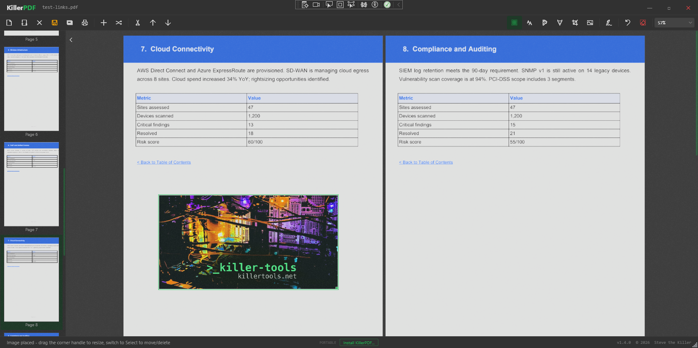
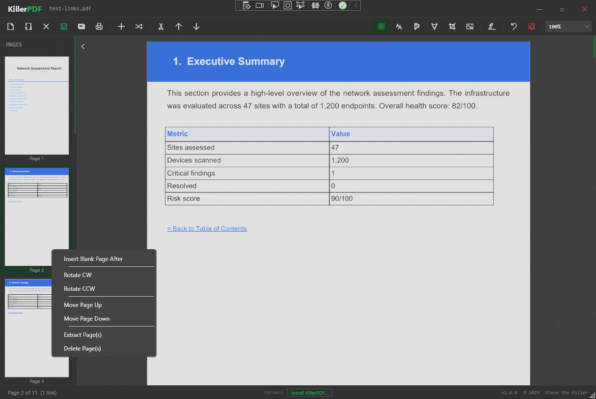

# KillerPDF

[](https://oosmetrics.com/repo/SteveTheKiller/KillerPDF)
[](https://oosmetrics.com/repo/SteveTheKiller/KillerPDF)

PDF editor for field techs. View, annotate, merge, split, edit text, draw, sign, print, flatten, and open password-protected PDFs without an Adobe subscription or a phone-home. Install or run portable. Single Windows EXE, ~6 MB zipped, no runtime install required.

Part of [killertools.net](https://killertools.net).

## Features

- High-quality rendering via PDFium
- Merge multiple PDFs and split out selected pages, drag-and-drop page reordering
- Inline text editing with font matching against the original document
- Text boxes, freehand drawing, and highlight overlays with adjustable color, size, and opacity
- Draw and save reusable signatures or import a PNG/JPG/BMP image as a signature, click to place anywhere on a page
- Insert images onto any page as resizable annotations — drag the corner handle to scale, burned into the PDF on save
- Crop tool with corner drag handles; Enter to apply, Escape to cancel, remove crop from one page or all pages
- Right-click sidebar: insert blank page, rotate CW/CCW, move up/down, extract, or delete — works on multi-page selections
- Clickable PDF links and internal cross-references, including TOC back-links
- Multi-page grid view toggle — switch between a scrollable grid of all pages and a focused single-page view
- Zoom preset dropdown with scroll-wheel sync; Fit to Width and Fit Page re-apply on window resize
- Page number jump box in the toolbar — type a page number and press Enter to navigate directly
- Arrow key navigation and middle mouse button panning
- Ctrl+S saves to the current file; Ctrl+Shift+S opens Save As
- Keyboard shortcut overlay — press Ctrl+? for a full shortcut reference
- Full-text search across the entire document with result highlighting, drag-select to copy text
- Print with annotations flattened into the output
- Save Flattened PDF: rasterizes every page at 150 DPI into a fully uneditable document
- Password-protected PDF support: prompts for password instead of erroring
- Self-installing EXE: installs per-user to %LOCALAPPDATA% (no UAC), registers as PDF file handler, adds Start Menu and optional Desktop shortcuts, uninstalls cleanly via Add/Remove Programs

## Screenshots





## Requirements

- Windows 10 or 11 (x64)
- No runtime install. Everything needed is inside the EXE (targets .NET Framework 4.8, which ships with every supported Windows release).

## Download

```
winget install killerpdf
```

- Prebuilt binary: <https://github.com/SteveTheKiller/KillerPDF/releases/latest/download/KillerPDF.zip>
- Source (GPL3 corresponding source for this release): <https://github.com/SteveTheKiller/KillerPDF/releases/download/v1.4.0/KillerPDF-1.4.0-src.zip>

## Build from source

```powershell
git clone https://github.com/SteveTheKiller/KillerPDF.git
cd KillerPDF
dotnet publish -c Release
```

Output lands in `bin/Release/net48/publish/`. The publish step produces a single Costura-bundled `KillerPDF.exe` plus a versioned `KillerPDF-<version>-src.zip` for GPL3 source distribution.

Requires the .NET 8 SDK or later to build (even though the output targets .NET Framework 4.8).

## Changelog

See [CHANGELOG.md](CHANGELOG.md).

## Why this exists

I hate Adobe. Acrobat is bloated, tries to hijack file associations, wants a subscription to do basic things, and phones home constantly. Most of the "free" alternatives are either ad-riddled, cloud-based, or rebrands of the same PDF engine sold under three different names.

KillerPDF is what I wanted: local-only, portable, no account, no telemetry. The PDF equivalent of Notepad.

## License

GPLv3. See [LICENSE](LICENSE). If you fork, modify, or redistribute KillerPDF, your version must also be released under GPLv3 with source available. No exceptions for commercial rebrands.
